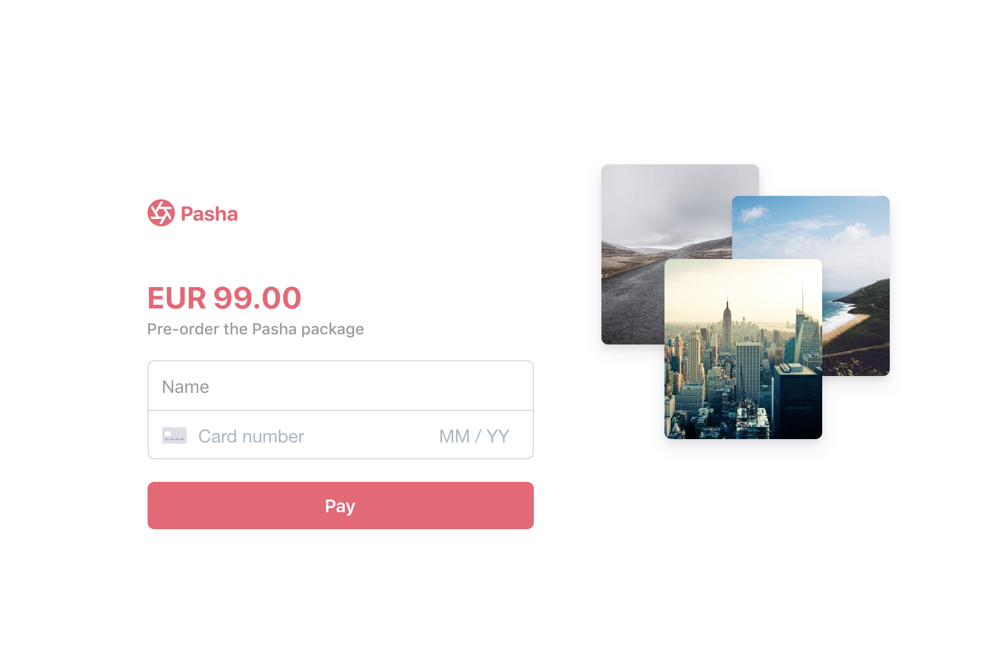

# Card Payment using React

This code sample shows how to build a card form to take a payment using the [Payment Intents API](https://stripe.com/docs/payments/payment-intents), [Stripe Elements](https://stripe.com/payments/elements) and [React](https://reactjs.org/). The code sample has been created using the scaffolding provided by Stripe using the [React Elements Card Payment sample](https://github.com/stripe-samples/react-elements-card-payment).



## Features

This sample consists of a `client` in React and a `server` piece. The server is written using [Node.js](https://nodejs.org/en/) and the client is implemented using `create-react-app` to provide the boilerplate for React. Stripe Elements is integrated using [`react-stripe-elements`](https://github.com/stripe/react-stripe-elements), which is the official React library provided by Stripe.

## How to run locally

To run this sample locally you need to start both a local dev server for the `front-end` and another server for the `back-end`.

You will need a Stripe account with its own set of [API keys](https://stripe.com/docs/development#api-keys).

Start by cloning this GitHub repo by running the following command in the Terminal.

```
git clone https://github.com/ashwinbhatnagar/card-payment-take-home-test.git
```

Copy the .env.example file into a file named .env in the folder of the server you want to use. For example:

```
cp .env.example server/.env
```

You will need a Stripe account in order to run the demo. Once you set up your account, go to the Stripe [developer dashboard](https://stripe.com/docs/development#api-keys) to find your API keys.

```
STRIPE_PUBLISHABLE_KEY=<replace-with-your-publishable-key>
STRIPE_SECRET_KEY=<replace-with-your-secret-key>
```

`STATIC_DIR` tells the server where to the client files are located and does not need to be modified unless you move the server files.

### Running the API server

1. Go to `/server`
2. Install dependencies

```
npm install
```

3. Run the application

```
npm start
```
The server is now running at `localhost:4242`.

### Running the React client

1. Go to `/client`
1. Run `yarn`
1. Run `yarn start` and your default browser should now open with the front-end being served from `http://localhost:3000/`.

### Using the code sample

When running both servers, you are now ready to use the app running in [http://localhost:3000](http://localhost:3000).

1. Enter your name and [card details](https://stripe.com/docs/payments/accept-a-payment#web-test-integration)
1. Hit "Pay"
1. 🎉

## Author(s)

[@abhatnagar](https://twitter.com/abhatnagar)
